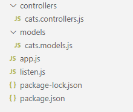
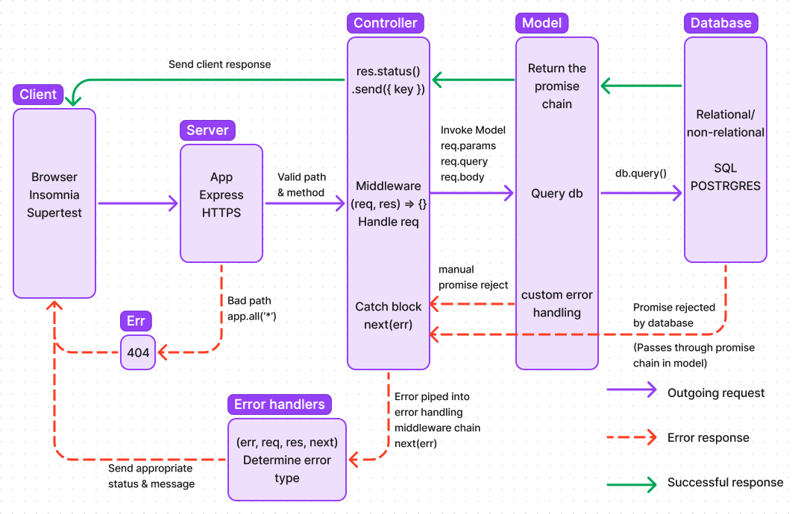
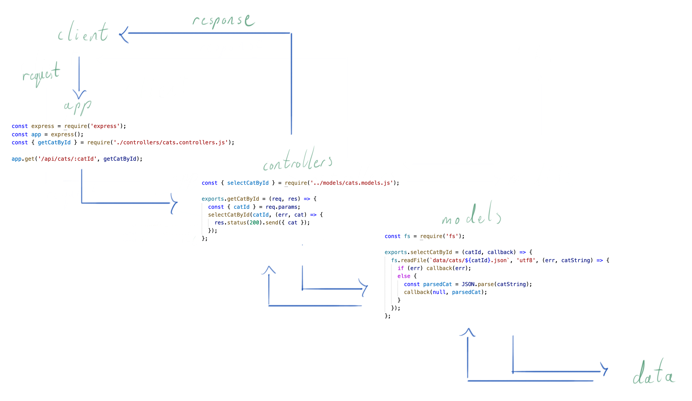

# Model-View-Controller Pattern

## Prior Knowledge

- Setting up an express application
- Awareness of middleware (express.json())
- RESTful endpoints
- Controller functions always invoked with `req` and `res` (at the moment)
- Parametric endpoints (`req.params`) and queries (`req.query`)

## Learning Objectives

- Understand how the MVC (Model View Controller) pattern can help us write more maintainable servers

## What is the MVC Pattern?

The MVC pattern is a software design pattern commonly used for developing web servers by handling different aspects of the application with different functions.

- **Controller**: Handles the client request, and using the information contained on the request (path, params, queries and body) will invoke the model which will interact with the dataset, and will then send a response to the client with the appropriate data.
- **Model**: Handles the fetching, updating, creating and deleting of data, and sends the data in the required format to the controller based on controller’s instructions.
- **View**: Displays data to user in easy-to-understand format, based on the user’s actions (_We won't be dealing with views for a little while_)

## Why not write an entire server all in one function / file?

As in the examples we have seen so far, our functions can become complex, and deeply nested when building a web server, whether with `http`, `express` or any other framework. In order to be able to clearly identify what is going on in the server and help debug errors, we can instead have all the logic abstracted away into separate functions. To do this consistently, we will be using the MVC (Model-View-Controller) pattern, splitting our code up into separate functions that are responsible for different things within our server as per the following examples:

```js
// app.js
// - our server

app.get("/api/cats/:catId", getCatById);

// controllers.js
// - responsible for handling the request, invoking the model, and sending the response
exports.getCatById = (req, res) => {
  const { catId } = req.params;
  selectCatById(catId, (err, cat) => {
    res.status(200).send({ cat });
  });
};

// models.js
// - responsible for interacting with the data and sending data back to the controller (in this case using the callback parameter)
exports.selectCatById = (catId, callback) => {
  fs.readFile(`data/cats/${catId}.json`, "utf8", (err, catString) => {
    if (err) callback(err);
    else {
      const parsedCat = JSON.parse(catString);
      callback(null, parsedCat);
    }
  });
};
```

## Project Structure

Now that we have an increasing number of functions to deal with we need a maintainable directory structure to store these files. Keeping each category of function (`controllers` / `models`) keeps them distinct and when we come to add more these directories can easily be added to.

Another helpful pattern can be to add an extension to the file name to help identify files of the same name. For example below we need both `controllers` and `models` for our cats resource so the files are named `cats.controllers.js` and `cats.models.js` to keep them distinct.



## MVC Flow

When dealing with multiple files it can be helpful to visualise the flow of data through our servers. Below is an illustration .



**nb** In the example below of a client making a request to our `/api/cats/:catId` endpoint, the controller invokes a single model but in more complicated endpoints the controller can make use of multiple models from different files in order the process the request.


